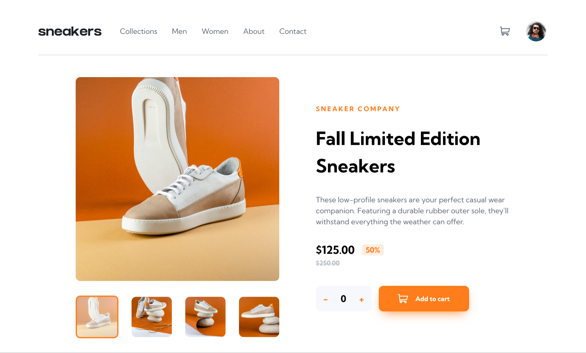

# Frontend Mentor - E-commerce product page solution

This is a solution to the [E-commerce product page challenge on Frontend Mentor](https://www.frontendmentor.io/challenges/ecommerce-product-page-UPsZ9MJp6). Frontend Mentor challenges help you improve your coding skills by building realistic projects.

## Table of contents

- [Overview](#overview)
  - [The challenge](#the-challenge)
  - [Screenshot](#screenshot)
  - [Links](#links)
- [My process](#my-process)
  - [Built with](#built-with)
  - [What I learned](#what-i-learned)
  - [Continued development](#continued-development)
  - [Useful resources](#useful-resources)
- [Author](#author)

## Overview

### The challenge

Users should be able to:

- View the optimal layout for the site depending on their device's screen size
- See hover states for all interactive elements on the page
- Open a lightbox gallery by clicking on the large product image
- Switch the large product image by clicking on the small thumbnail images
- Add items to the cart
- View the cart and remove items from it

### Screenshot

### Links

- Solution URL: [https://github.com/notanut/ecommerce-app.git](https://github.com/notanut/ecommerce-app.git)
- Live Site URL: [https://notanut.github.io/ecommerce-app/](https://notanut.github.io/ecommerce-app/)

## My process

### Built with

- CSS custom properties
- Flexbox
- [React](https://reactjs.org/) - JS library

### What I learned

This was the first time I learn how to use useContext and useReducer. They works like magic! With useContext, we don't need to passing any props, which make everything easier to work with!

### Continued development

I wanna use useContext and useReducer more. I should master another React Hooks too, they're all awesome and help a lot.

### Useful resources

- [useContext Tutorial](https://upmostly.com/tutorials/how-to-use-the-usecontext-hook-in-react) - This helped me to understand the usage of useContext
- [useContext & useReducer](https://dev.to/jackent2b/the-best-couple-usecontext-usereducer-4e65) - This is an amazing article which helped me finally understand these React Hooks. I'd recommend it to anyone still learning this concept.

## Author

- Website - [Natasya](projects-nat.netlify.app/)
- Frontend Mentor - [@notanut](https://www.frontendmentor.io/profile/notanut)
